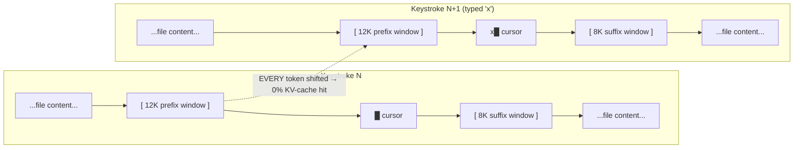
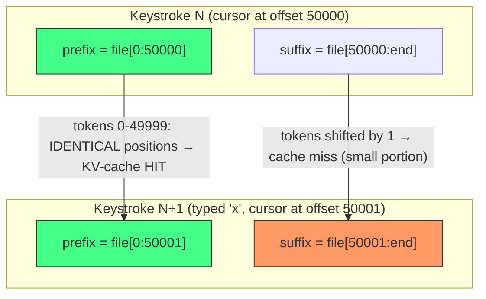
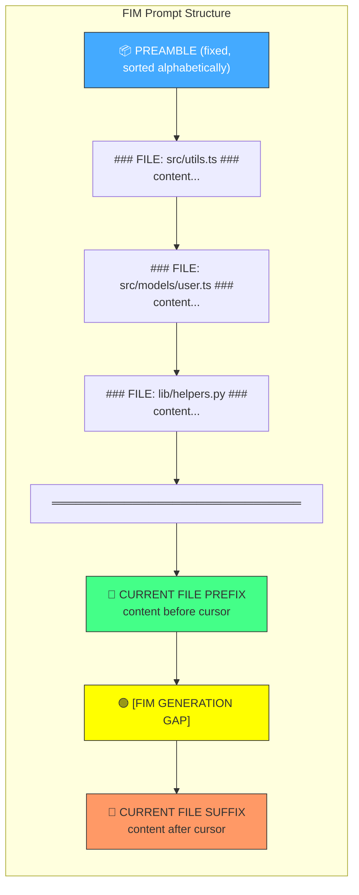
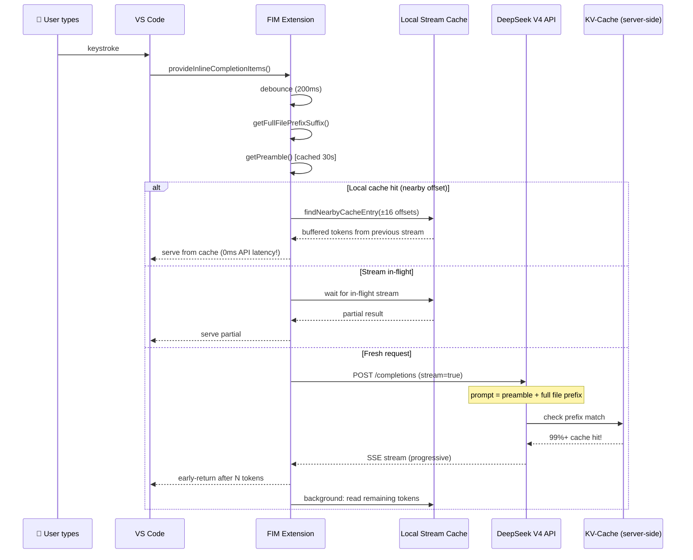
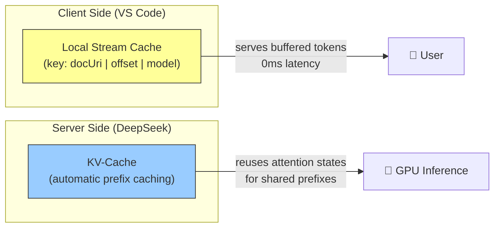

# FIM Inline Completion

A high-performance VS Code extension for AI-powered inline code completion using the **DeepSeek V4 FIM (Fill-In-the-Middle) API**.

> **Key insight**: By sending the *entire* current file (not a sliding window) plus a *cross-file project preamble*, we achieve **~99% server-side KV-cache hit rates** during continuous typing. This makes completions feel instant after the first keystroke.

## Architecture

### The Sliding-Window Problem (How NOT to do it)

Traditional approaches send a fixed-size window around the cursor:



With a sliding window, **every keystroke shifts all token positions**. The LLM server cannot reuse any previously computed attention states (KV-cache). Every request is a full recomputation.

### The Full-File Solution

Instead, send the **entire file** as prefix + suffix:



**Result**: ~99.998% of tokens are at identical positions between keystrokes. DeepSeek's server-side **automatic prefix caching** (standard in vLLM/SGLang) reuses the KV-cache for the shared prefix portion, making subsequent requests dramatically faster.

### Multi-File Project Preamble

We go even further by loading **all project source files** (filtered by `.gitignore`) into a **preamble** that is prepended to every FIM request:



**Why this works**:
- The preamble files are loaded once and **never change positions** between keystrokes → **100% KV-cache hit**
- The current file prefix grows by only 1 character per keystroke → **near-100% KV-cache hit**
- Only the suffix portion shifts → small cache miss, but the suffix is typically much smaller than the prefix
- Files are sorted alphabetically for **deterministic token ordering** across sessions

### Request Flow



### Cache Architecture

The extension maintains two complementary caching layers:

| Layer | Location | What it caches | Hit condition |
|-------|----------|---------------|---------------|
| **Local Stream Cache** | Extension memory | Already-streamed completion tokens | Same document ±16 char offset (instant, no API call) |
| **Server-Side KV-Cache** | DeepSeek servers | Computed attention states for all input tokens | Prefix tokens at identical positions (dramatically reduces inference time) |



### Configuration Highlights

| Setting | Default | Purpose |
|---------|---------|---------|
| `FIM.preambleEnabled` | `true` | Enable cross-file project context |
| `FIM.preambleMaxFiles` | `100` | Max other files in preamble |
| `FIM.preambleMaxChars` | `500000` | Soft cap on preamble chars (~125K tokens) |
| `FIM.maxTokens` | `256` | Completion length (max 4096 for FIM Beta) |
| `FIM.streamEnabled` | `true` | Progressive display (show first chunk ASAP) |
| `FIM.streamTokens` | `5` | Tokens to collect before first display |
| `FIM.model` | `deepseek-v4-pro` | Model (1M token context window) |

## Getting Started

### Prerequisites

- VS Code 1.90+
- DeepSeek API key ([get one here](https://platform.deepseek.com/api_keys))

### Installation

1. Install the extension
2. Run `FIM: Set API Key` from the Command Palette (`Ctrl+Shift+P`)
3. Start typing — completions appear automatically

### Manual Setup

```bash
git clone https://github.com/xiaodong-hu/FIM_Inline_Completion
cd FIM_Inline_Completion
npm install
npm run compile
```

Then press `F5` in VS Code to launch the Extension Development Host.

### API Key

Set via the `DEEPSEEK_API_KEY` environment variable, or run `FIM: Set API Key` to store it securely in VS Code's SecretStorage.

## DeepSeek FIM API

This extension uses the [DeepSeek FIM Completion Beta API](https://api-docs.deepseek.com/guides/fim_completion):

- **Endpoint**: `POST https://api.deepseek.com/beta/completions`
- **Model**: `deepseek-v4-pro`
- **Context window**: 1M tokens
- **Max output**: 4K tokens
- **Format**: True Fill-In-the-Middle — both `prompt` (prefix) and `suffix` fields are supported

The prompt sent to the API follows this structure:
```
[### FILE: src/utils.ts ###\n<content>\n### FILE: src/models.ts ###\n<content>\n...]
[<current file content from beginning to cursor>]
```

The suffix sent to the API:
```
[<current file content from cursor to end>]
```

## Performance Notes

### Why Completions Feel Fast

1. **First keystroke**: Full preamble + full file sent (~500K chars / 125K tokens). May take 500-1500ms depending on context size.
2. **Subsequent keystrokes**: DeepSeek's prefix-caching reuses ~99%+ of the computed KV-cache. Latency drops to 100-300ms.
3. **Streaming early-return**: The extension shows the first few tokens as soon as they arrive (typically <200ms), giving an instant-feel response even on the first request.
4. **Local cache**: When typing rapidly, already-streamed tokens from the previous request are served from memory with 0ms latency.

### Memory Usage

- The local stream cache holds at most a few entries (~KB each), evicted after 30s of inactivity.
- The preamble cache holds file contents in memory (~500KB for a typical project), rebuilt every 30s or on file create/delete events.

## License

MIT
